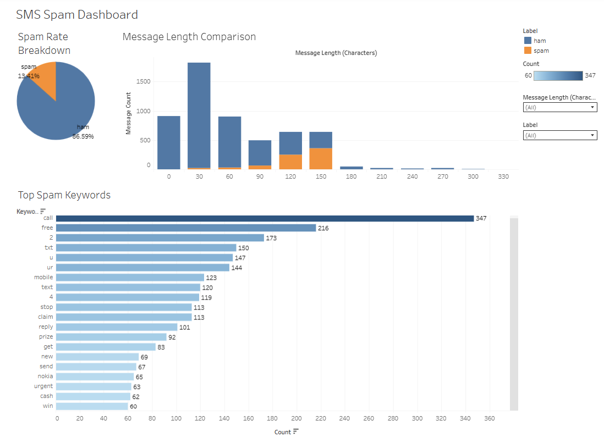

# 📩 SMS Spam Detection: NLP Behavior Analysis

### Analyzing text behavior in spam vs. ham using SQL, Python, and Tableau to uncover messaging patterns and risk indicators.

This project explores message-level behavioral differences in spam versus legitimate (ham) texts using light natural language processing (NLP), SQL analytics, and final dashboard visualizations. The insights aim to inform prioritization strategies, message filtering enhancements, and user segmentation logic for companies running outreach or lead-generation campaigns.

---

## 🧾 Executive Summary

This analysis answers three practical business questions:

1. **Which keywords or phrases are most common in spam?**  
2. **How do spam and non-spam messages differ in length or structure?**  
3. **What percent of messages are spam overall?**

### 📊 Dashboard Overview

- The Tableau dashboard includes:
  - A spam rate gauge and spam vs. ham breakdown
  - Message length distribution histograms by label
  - Word cloud or keyword rankings from spam messages (NLP)
  - Structural comparisons (character and word count)

> 🔗 [View the live dashboard on Tableau Public](YOUR_TABLEAU_PUBLIC_LINK_HERE)



---

### ✅ Actionable Recommendations

- **🧠 NLP Insight: These appear disproportionately in spam and can be used in spam filters or fraud detection logic.**  
  - Flag common spam trigger phrases such as “win”, “free”, “cash”, and “urgent”.

- **📊 Analyst Insight: Spam tends to be longer and more keyword-dense than ham messages.**  
  - Use message structure features (length, word count) in spam classification models.

- **📈 Strategy Insight: Periodic updates to keyword models may improve filtering effectiveness and reduce false positives.**  
  - Monitor and adapt to spam trends over time. 
---

## 🔍 Deep Dive: Analytical Approach

### 📄 Dataset Overview

- Cleaned version of the [SMS Spam Collection Dataset (Kaggle)](https://www.kaggle.com/datasets/uciml/sms-spam-collection-dataset)
- Contains two columns: `label` (spam or ham) and `message`
- Preprocessed in Python to add:
  - `message_length` (character count)
  - `word_count` (number of words)

### 🧮 SQL-Based Analysis

- Used MySQL to answer:
  - Spam message frequency and rate
  - Structural analysis of spam vs. ham
  - Preprocessed keyword extraction summary (Python-assisted)

- Cleaned and enriched CSV imported into MySQL for query-based exploration

### 📊 Tableau Visualizations

- **Bar charts** for spam rate and message structure differences  
- **Histograms** of message lengths by category  
- **Word cloud** or **ranked terms** for spam keyword trends  

---

## 🔗 Data Source

This dataset is publicly available on Kaggle:  
[SMS Spam Collection Dataset – UCI Repository](https://www.kaggle.com/datasets/uciml/sms-spam-collection-dataset)

---

## 🛠️ Tools Used

- **SQL (MySQL dialect):** For message pattern analysis and spam ratio calculations  
- **Python (Pandas, NLTK):** For NLP preprocessing and enrichment  
- **Tableau Public:** For building the final dashboard presentation  

---

## 📁 Repository Structure

```
sms-spam-nlp-analysis/
│
├── data/
│   └── sms_spam_enriched.csv
│
├── sql/
│   ├── create_table.sql
│   ├── q1_spam_rate.sql
│   ├── q2_message_length.sql
│   └── q3_keywords_placeholder.sql
│
├── images/
│   └── dashboard_preview.png
│
├── LICENSE
├── README.md
```

---

## 👋 About the Analyst

**Jeremy Gutierrez**  
SQL-first Data Analyst focused on real-world messaging behavior, campaign optimization, and effective dashboard storytelling.  
[Connect on LinkedIn](https://www.linkedin.com/in/jeremy-gutierrez-4502391bb/) • [View GitHub Portfolio](https://github.com/JZambrana1612)
